## 🏗️ Building a Modern Data Warehouse

### Overview:

This project is focused on building a Modern Data warehouse to meet the needs of the business stakeholders. The quality of the data should be the best, and it should be easily accessible to other teams in the business. This is what this project is all about.

We utilize Mage AI, an open-source ETL tool. This will be used to extract, transform, and load the data into the warehouse. Moreover, we utilize GCP's BigQuery as the Data warehouse to store our data and model.

### The problem:
We have requirements from the business stakeholders for data for analytics purposes. The domain expert has provided then information that we should pull data from the ERP and the CRM databases. So, we know the source of the data and we need to get to our end users. 

### Project's solution architecture:

The architecture of this project is provided below. We have used the _Medallion Architecture_. This is modern and robust, ensuring the overall quality and correctness of the expected Data product.  

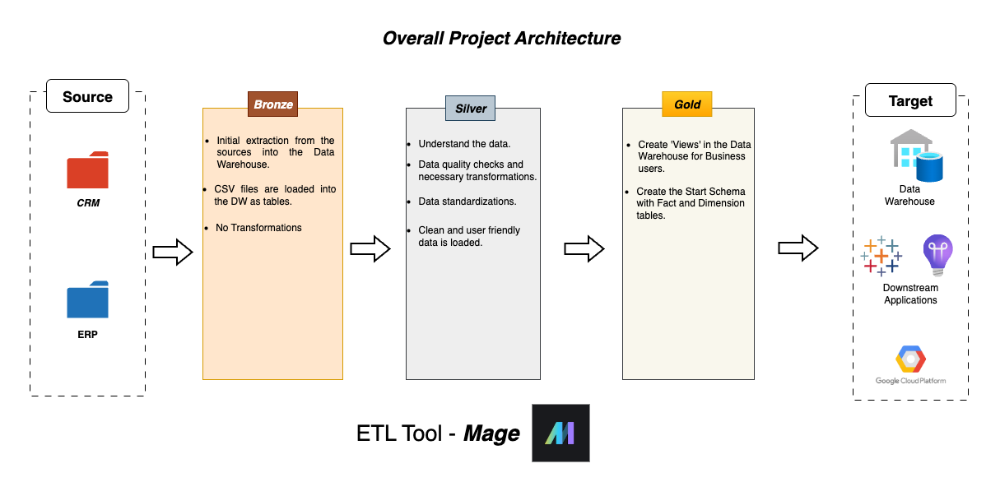

The source for this project will be CSV files from the CRM and ERP departments of the business. The requirement it to build a data warehouse for the stakeholders and other analysts to work with this data effectively.

As the first step , we load all the data files into _Bronze layer_ of the warehouse. Here, the focus is to move the data into the warehouse only. We do not clean or transform the data in any form. So, the data is inside our warehouse now.

As the next step, we look into the data and make efforts to understand it and see if the quality is good in the _Silver Layer_. We apply transformations to the data if the quality does not meet the required standards. Some of the essential cheks will be duplicate records, missing values, trailing spaces in strings, and standardizing the categorical data. Finally, we renamed the columns into user-friendly names from technical source system names since they will be used by stakeholders and analysts.

In the final step, we create the Fact and Dimension tables (Start Schema) for our data. We will create 'Views' in BigQuery that the stakeholders will use. This is the _Gold Layer_.

The Medallion Architecture is robust and clearly distinguishes the different states of the data. This is helpful in creating high quality dataset and offers high visibility when issues arises with the data pipelines. For instance, the Bronze Layer will contain all the raw data from the source, and we can always come back to investigate issues. This helps in debugging. 

This helps in achieveing an important concept, ___Separation of Concerns___ (SOC). It simply states that the components of our system should not repeat or that no two steps should do the same activity. In our case, we keep the transformations only in the Silver Layer and raw data only in the Bronze. The raw data is not carried forward to the silver, nor is any transformation done in the bronze layer. The process is completely separate.

### Visualization of the ETL pipeline. 

> This helps us visually understand how the pipeline is formed and chains all the components together. It helps to track and debug if the pipeline breaks.

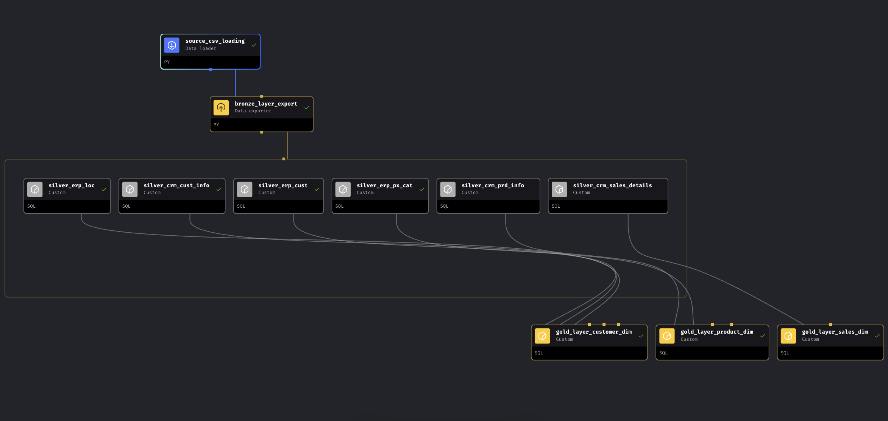

The blue block _'source_csv_loading'_ extracts the raw data from the source systems. The following yellow block _'bronze_layer_export'_ is the Bronze Layer where a data warehouse is created in BigQuery, and the raw data is loaded into it. 

Now we are in the silver layer. Here, we understand the data in detail. The table below shows all the tables we have. We assess the quality of each and every column in the dataset and make the necessary cleaning, transformations, and enrichments.

| **Source Table Name**          | **Description**        |

| ----------------------    | ----------------------------- |

| `crm_cust_info`           | CRM – Customer Information    |

| `crm_prd_info`            | CRM – Product Information     |

| `crm_sales_details`       | CRM – Sales Details           |

| `erp_cust`                | ERP – Customer Data (AZ12)    |

| `erp_loc`                 | ERP – Location Data (A101)    |

| `erp_px_cat`              | ERP – Product Category (g1v2) |

> Below is the chart that maps the relationship between all the tables. This helps us to figure out how we can connect all the information together so it can be used in the downstream tasks.

After analysing the tables, we can identify that some tables consist of customer informations, some have the product, and some have the sales information. Now, we can connect these tables with their respective groups.

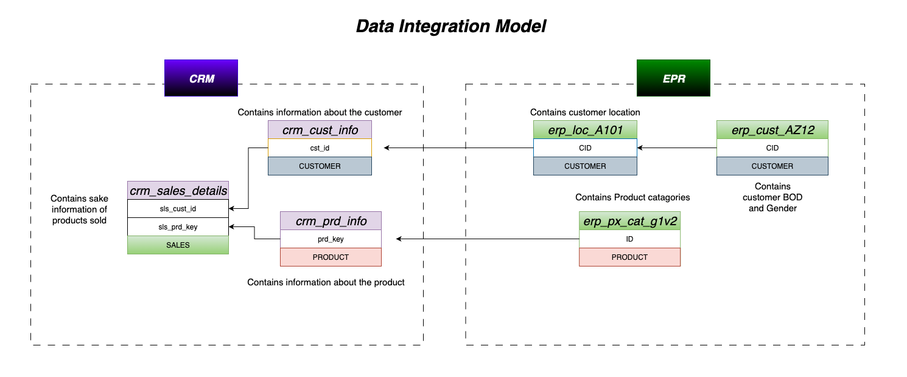

After this step, we move on to the important task in the silver layer. We focus on cleaning the data and applying transformations to enhance it to the best form for usage. In the ETL tree diagram, each block is connected to the bronze layer of the BigQuery data warehouse. This allows us to directly query the data and manipulate it using Mage. Before this process, we need to configure Mage with our GCP service account and update the io_config file. This establishes a connection between Mage and GCP. Additionally, we add an extra metadata column to the tables 'record_inserted_at', this records the time at which the data was last added to the silver layer from the bronze. 

### Most common quality issues encountered were:

_The changes that I have made to the data are to the best of my knowledge. But in real work, we should always reach out to the source system domain experts in the company to understand the discripancies and resolve them with their advice._

1. Null values in the primary keys of the tables.

2. Extra space before and after strings, which were stripped using the TRIM() function.

3. Categorical columns that consisted of abbreviated forms were swapped with user-friendly language. For example, 'M' changed to 'Male' in gender.

#### _crm_cust_info_ - Bronze Layer Quality
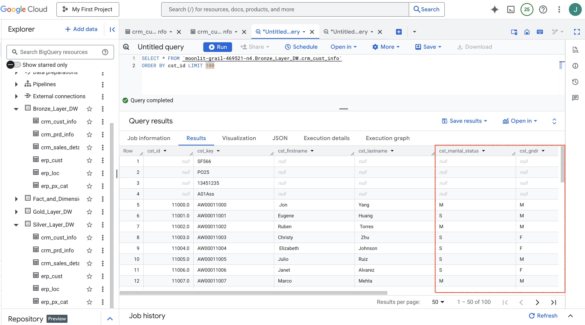

#### _crm_cust_info_ - Silver Layer Quality
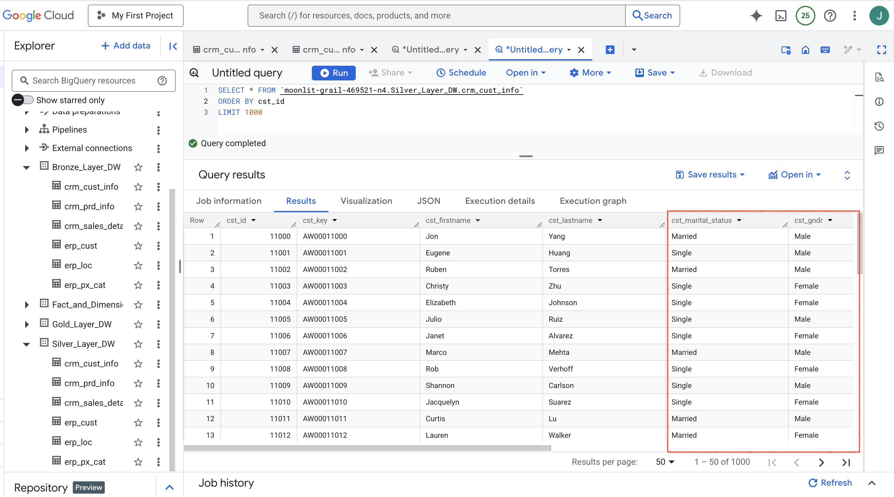

4. the ID column 'erp_cust' had values like 'NASAW00011000', whereas the ID column in 'erp_loc' had the format 'AW-00011000'. Therefore, the data was transformed accordingly.

#### _erp_cust_ - Bronze Layer Quality
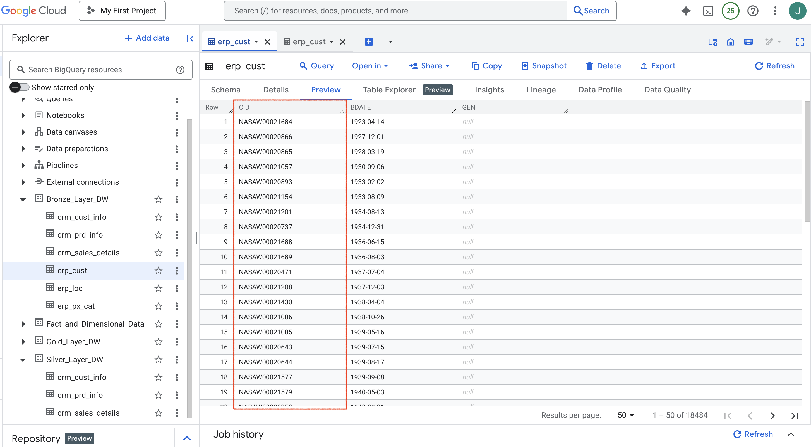

#### _erp_cust_ - Silver Layer Quality
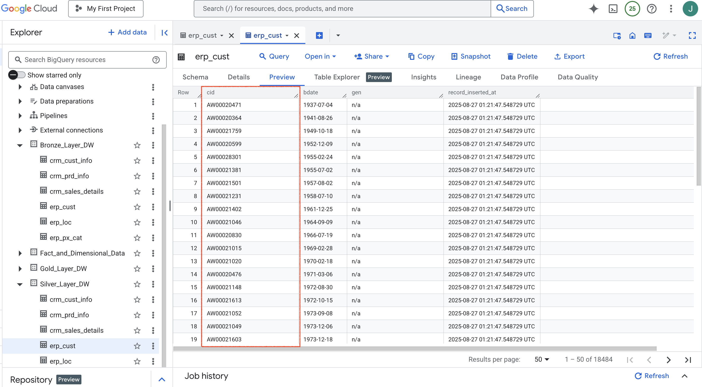

5. Some ID columns were fused, which were split and stored as separate columns with new names as shown below. 

#### _crm_prd_info_ - Bronze Layer Quality
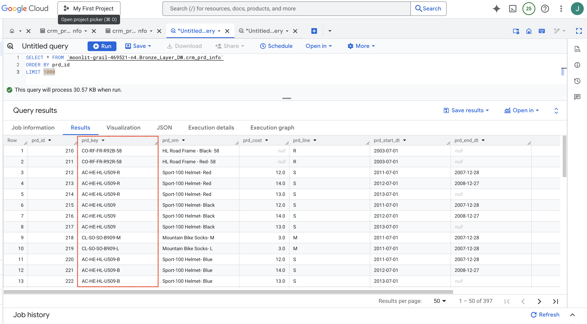

#### _crm_prd_info_ - Silver Layer Quality
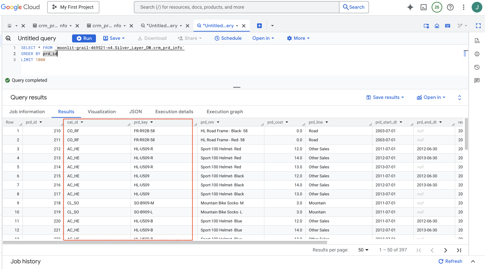

5. Some date columns were stored as INT type '20101229', which was transformed to '2010-12-29'.

#### _crm_sales_details_ - Bronze Layer quality
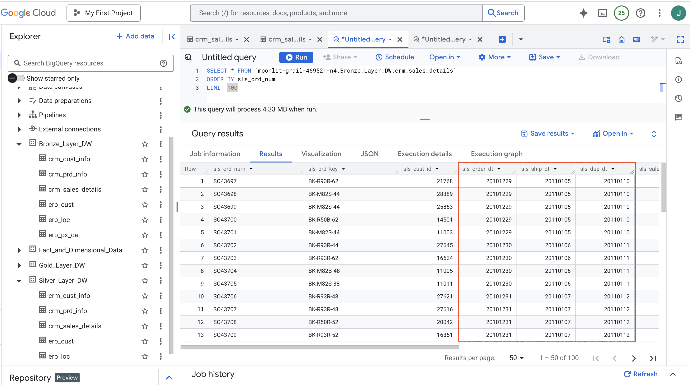

#### _crm_sales_details_ - Silver Layer quality
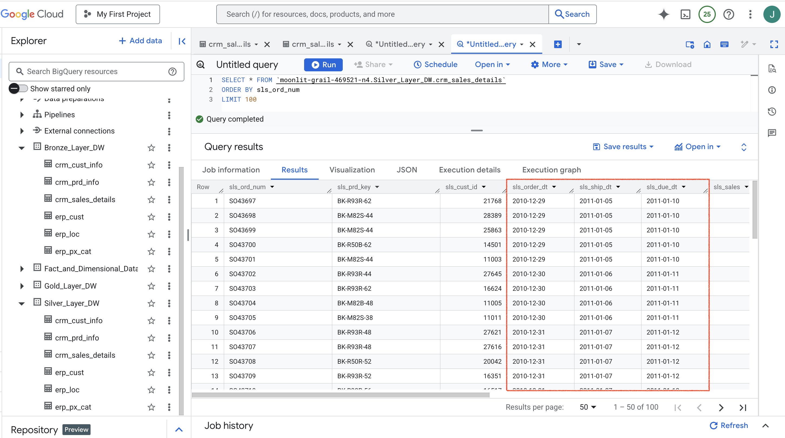

6. If values were missing, meaningful alternatives were assigned. For instance, if gender has null, is was assigned with 'n/a'. 

7. Technical column names were changed to simple names for ease of understanding.

After applying all transformations and cleaning, we load the new data into the Gold Layer. Here we create 'views' in BigQuery. A view encapsulates the results of a SQL query and displays them to the users. We will create the Fact and Dimension tables in the Gold Layer. Dimensions are the attributes of an entity. For instance, age, name, dob are attributes of customers. So we can add them to the dimension table of the customer. Whereas sale amount, sale qty, sale discount, shipping date, and order date are transactional values, which are facts. These values can be aggregated. This forms the fact table. These tables will be of high quality for analysis and other downstream tasks. 

#### Gold Layer Quality
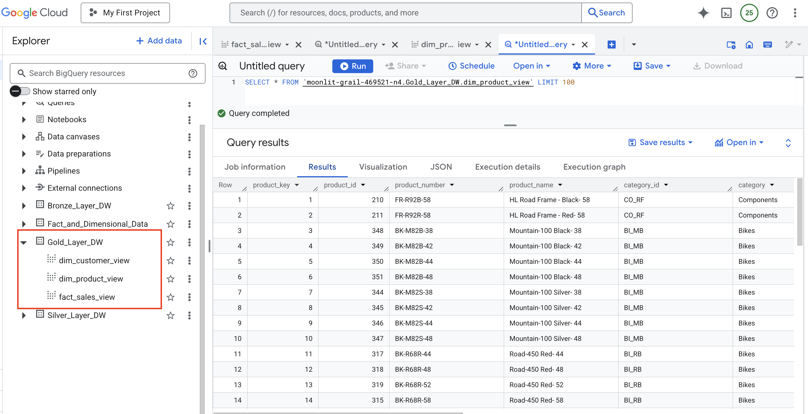

From the above, we can see that, 'Views' are created for all the dimension and fact tables in our warehouse.

### Star Schema:

In the star schema, the fact table is in the middle and is connected with the dimensions through the foreign keys. Using these keys, we can access attributes from other dimensions and run analyses. For instance, in our schema, we can connect the product and customer table to find what is the revenue for a particular category of products and customers from a particular country. 

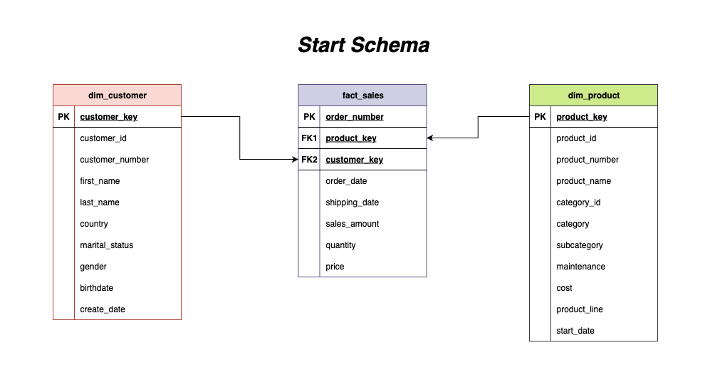

The start schema is the result of the Gold Layer for our users. We can use this data for any kind of analysis, such as dashboarding, ML model training, forecasting, or even as input for another ETL pipeline, which applies different transformations for a different use case.

Finally, we have the Data Flow chart, which captures the flow of the data between the Layers in the architecture. We can see how it transforms, and it helps when we want to debug any errors. 

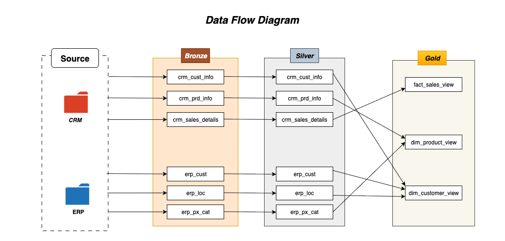

### Conclusion:

Using the Medallion architecture, a data warehouse was built using raw source files. They were loaded, cleaned, and exported through different layers, and the final data is presented for the users.

The respective Python and SQL queries can be found in the folders below in the repository. 

1. custom

2. data_exporters

3. data_loaders

